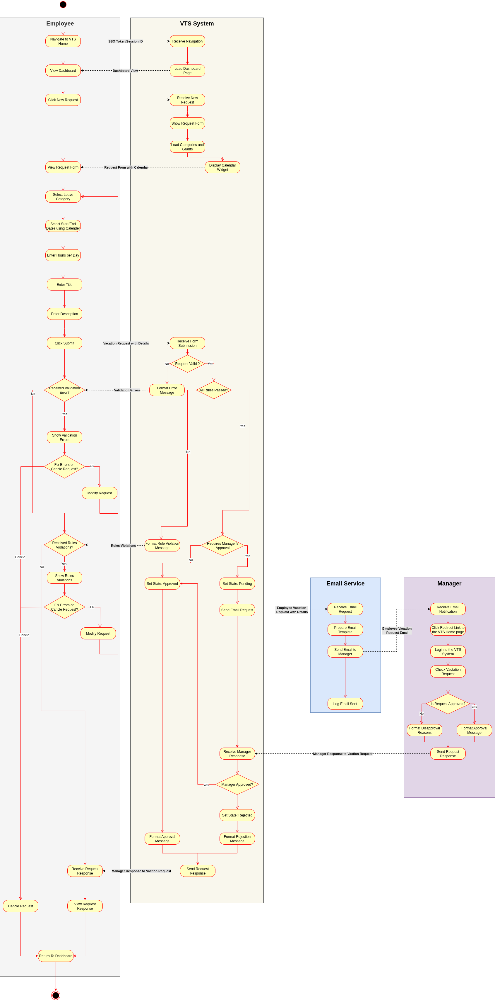
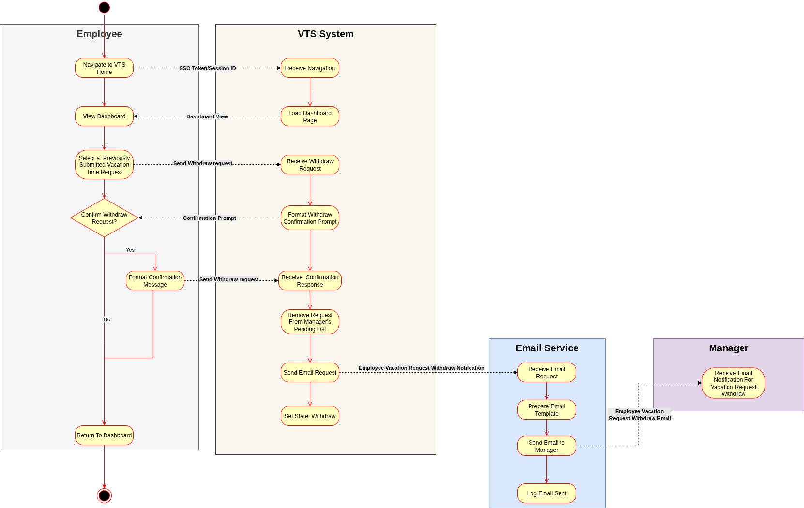
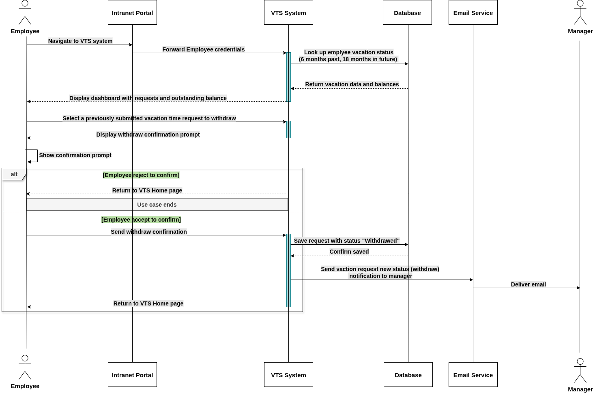
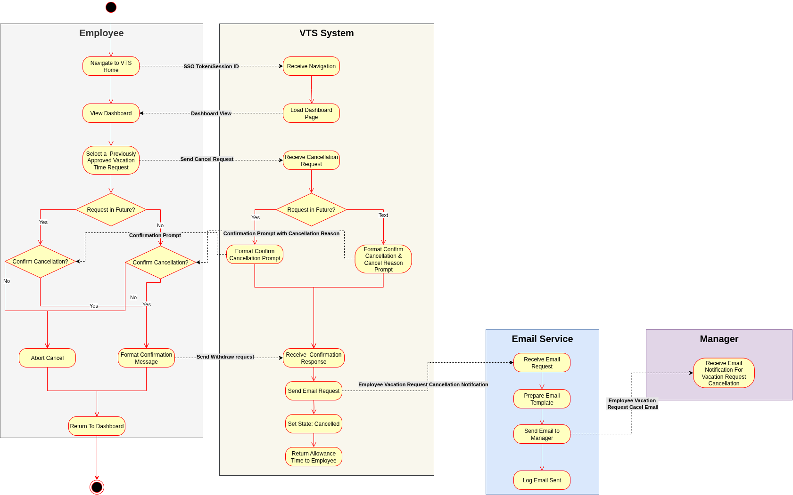
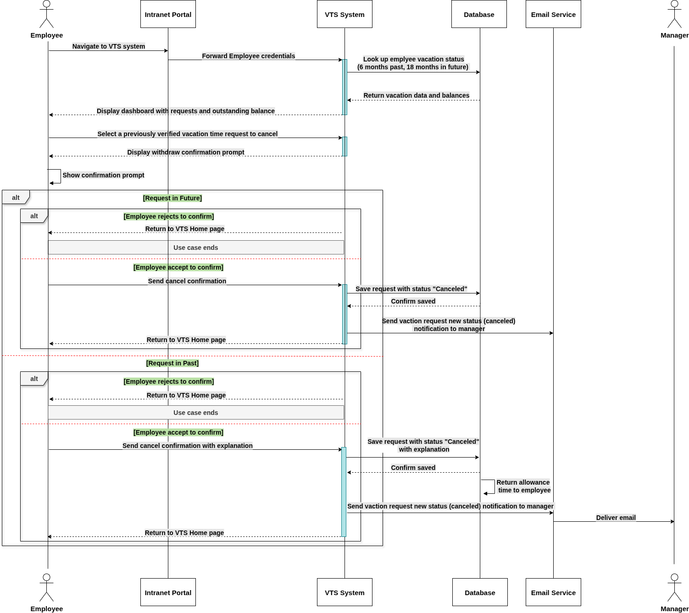
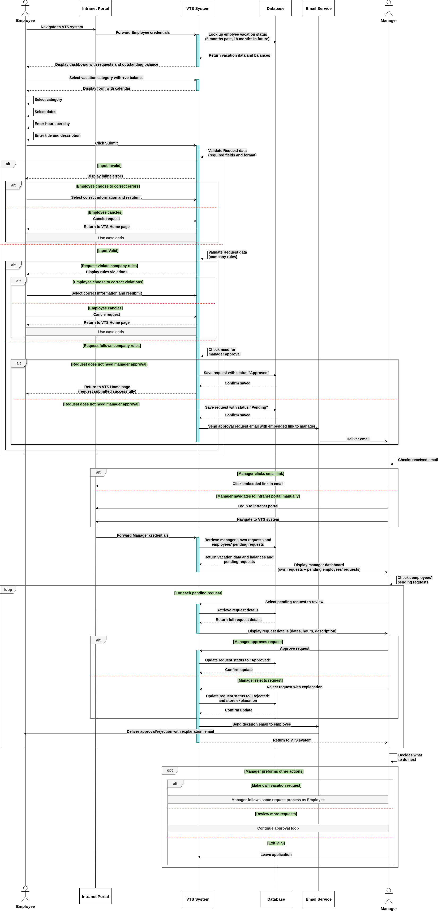
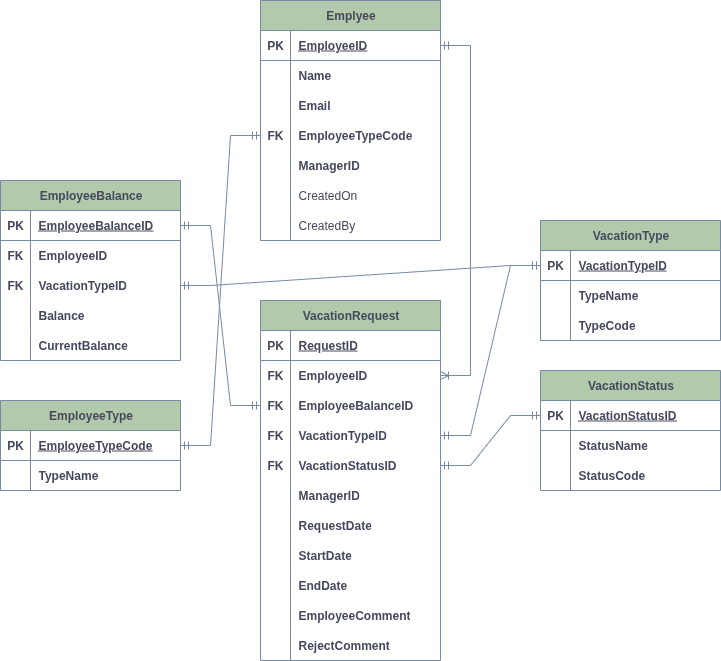

# Vacation Tracking System (VTS)

A web-based enterprise system for managing employee vacation requests, approvals, and leave balances. The VTS provides a centralized, automated workflow that empowers employees to self-manage their vacation time while ensuring compliance with company policies and streamlining HR administrative processes.

---

## Table of Contents

- [Vision](#vision)
- [Requirements](#requirements)
  - [Functional Requirements](#functional-requirements)
  - [Non-Functional Requirements](#non-functional-requirements)
- [Constraints](#constraints)
- [Use Cases](#use-cases)
  - [UC-01: Manage Time](#uc-01-manage-time)
  - [UC-02: Withdraw Request](#uc-02-withdraw-request)
  - [UC-03: Cancel Approved Request](#uc-03-cancel-approved-request)
  - [UC-04: Edit Pending Request](#uc-04-edit-pending-request)
- [Technology Stack](#technology-stack)
- [Documentation](#documentation)

---

## Vision

### Mission Statement

The Vacation Tracking System (VTS) provides individual employees with the capability to manage their own vacation time, sick leave, and personal time off, without having to be an expert in company policy or the local facility's leave policies.

### Problem Statement

The system addresses critical challenges in traditional vacation management:
- Manual vacation approval processes causing delays
- HR department bottlenecks in time-off management
- Managers lacking visibility into subordinate vacation schedules
- Employees uncertain about vacation balance and policies

### Impact

By automating vacation request workflows and enforcing complex policies automatically, VTS reduces HR administrative burden, empowers employee self-service, and ensures compliance with organizational leave policies.

**[Read Full Vision Document](docs/architecture/vision.md)**

---

## Requirements

### Functional Requirements

The system provides comprehensive functionality across four main areas:

**Core Features:**
- **Employee Authentication**: Integration with existing intranet portal SSO using Central Authentication Service (CAS)
- **Vacation Time Request**: Create, view, edit, withdraw, and cancel vacation requests with visual calendar interface
- **Manager Approval Workflow**: Review, approve, and deny subordinate vacation requests with email notifications
- **Comp Time Award Management**: Award personal leave time to subordinates within defined limits

**User Management:**
- Role-based access control (Employee, Manager, HR Clerk, System Administrator)
- Employee profile and leave balance display
- HR employee record management

**Business Logic:**
- Rules-based vacation request validation with flexible, configurable business rules
- Location and leave category management
- Grant management with automatic hour deduction and return
- Override capability for HR clerks with full audit logging
- Request state management (Pending, Approved, Denied, Withdrawn, Canceled)

**Integration & Reporting:**
- Email notification system for approval workflows
- HR legacy system integration
- Web service interface for internal queries
- Employee dashboard with personalized vacation information

**[Read Full Functional Requirements](docs/requirements/functional-requirements.md)**

---

### Non-Functional Requirements

The system is designed to meet strict quality standards across multiple dimensions:

**Performance:**
- Page load time ≤ 3 seconds for 95% of requests
- Support for 500 concurrent users (1,000 at peak)
- Database query execution ≤ 500ms
- API response time ≤ 500ms

**Security:**
- CAS-based authentication with SSO
- Role-based access control with strict authorization
- Data encryption (TLS 1.2+, AES-256 at rest)
- Comprehensive audit logging
- Input validation protecting against OWASP Top 10 vulnerabilities
- GDPR/CCPA compliance

**Usability:**
- WCAG 2.1 Level AA accessibility compliance
- Browser compatibility (Chrome, Firefox, Safari, Edge, IE11)
- Mobile-responsive design
- Intuitive interface requiring no specialized training

**Reliability & Scalability:**
- 99.5% uptime during business hours
- Horizontal scalability support
- Support for 50,000+ employee records and 500,000+ vacation requests
- Daily automated backups with tested recovery procedures

**Maintainability:**
- TypeScript/JavaScript coding standards with ESLint
- Modular NestJS architecture with dependency injection
- 80% unit test coverage, 70% integration test coverage
- Comprehensive documentation (OpenAPI/Swagger, TSDoc, ADRs)
- Structured logging with Winston/Pino

**[Read Full Non-Functional Requirements](docs/requirements/non-functional-requirements.md)**

---

## Constraints

The system development operates within several key constraints:

**Technical Constraints:**
- **Technology Stack Mandate**: Must use Node.js LTS 18.x+, NestJS framework, TypeScript
- **Browser Compatibility**: Must support HTML 3.2+ capable browsers, including IE11
- **Infrastructure**: Must deploy on existing organizational servers with no new hardware budget
- **SSO Integration**: Must integrate with existing CAS-based authentication (non-modifiable)

**Business Constraints:**
- **Budget**: No new hardware purchases; limited third-party service budget
- **Scope**: Limited to vacation management only (no payroll, full HR, or time tracking)

**Organizational Constraints:**
- **Team Size**: 3-5 developers, 1 part-time QA, 1 shared system administrator
- **Skill Set**: Varying NestJS/TypeScript experience across team
- **Access**: No direct production access; synthetic test data only

**Legal & Regulatory Constraints:**
- GDPR/CCPA compliance for employee data
- Employment law compliance per jurisdiction
- 2-7 year audit log retention requirements
- WCAG 2.1 Level AA accessibility requirements

**Integration Constraints:**
- HR legacy system API is read-only with batch synchronization
- Portal framework version fixed (managed by separate team)
- Corporate SMTP with rate limiting

**[Read Full Constraints Document](docs/requirements/constraints.md)**

---

## Use Cases

The VTS system is organized around four primary use cases, each with comprehensive design documentation including activity diagrams, sequence diagrams, and data models.

### UC-01: Manage Time

**Description:** Employees can create, view, and manage vacation time requests through a visual calendar interface. The system validates requests against configurable business rules, calculates balances automatically, and sends email notifications upon submission.

**Key Features:**
- Create new vacation requests with date selection, hours, title, and description
- View requests from previous 6 months to 18 months in future
- Real-time validation against company and location-specific policies
- Automatic balance calculation and grant deduction
- Email notifications to managers

#### Diagrams

**Activity Diagram:**

**Sequence Diagram:**

**Data Model:**

#### Documentation
- [Use Case Details](docs/use-cases/UC-01-manage-time/README.md)
- [Activity Diagram Description](docs/use-cases/UC-01-manage-time/flowchart.md)
- [Sequence Diagram Description](docs/use-cases/UC-01-manage-time/sequence-diagram.md)
- [Data Model Description](docs/use-cases/UC-01-manage-time/data-model.md)
- [Pseudocode](docs/use-cases/UC-01-manage-time/pseudocode.md)

---

### UC-02: Withdraw Request

**Description:** Employees can withdraw pending vacation requests before manager approval. The system updates request status, returns hours to the employee's balance, and notifies the manager of the withdrawal.

**Key Features:**
- Withdraw requests in "Pending" or "Pending Approval" state only
- Automatic hour return to appropriate grant
- Manager notification via email
- Complete audit trail of withdrawal action

#### Diagrams

**Activity Diagram:**

**Sequence Diagram:**

**Data Model:**

#### Documentation
- [Use Case Details](docs/use-cases/UC-02-withdraw-request/README.md)
- [Activity Diagram Description](docs/use-cases/UC-02-withdraw-request/flowchart.md)
- [Sequence Diagram Description](docs/use-cases/UC-02-withdraw-request/sequence-diagram.md)
- [Data Model Description](docs/use-cases/UC-02-withdraw-request/data-model.md)
- [Pseudocode](docs/use-cases/UC-02-withdraw-request/pseudocode.md)

---

### UC-03: Cancel Approved Request

**Description:** Employees can cancel previously approved vacation requests for future dates or recent past dates (within 5 business days). The system validates the cancellation eligibility, returns hours to balance, and notifies the manager.

**Key Features:**
- Cancel approved requests for future dates or recent past (5 business days)
- Business rule validation for cancellation eligibility
- Automatic hour restoration to grant
- Manager notification with cancellation details
- State transition logging

#### Diagrams

**Activity Diagram:**

**Sequence Diagram:**

**Data Model:**

#### Documentation
- [Use Case Details](docs/use-cases/UC-03-cancle-approved-request/README.md)
- [Activity Diagram Description](docs/use-cases/UC-03-cancle-approved-request/flowchart.md)
- [Sequence Diagram Description](docs/use-cases/UC-03-cancle-approved-request/sequence-diagram.md)
- [Data Model Description](docs/use-cases/UC-03-cancle-approved-request/data-model.md)
- [Pseudocode](docs/use-cases/UC-03-cancle-approved-request/pseudocode.md)

---

### UC-04: Edit Pending Request

**Description:** Employees can modify pending vacation requests before manager approval. Changes can include dates, hours, title, and description. The system re-validates the edited request against all applicable rules.

**Key Features:**
- Edit pending requests (title, comments, dates, hours)
- Re-validation against all business rules after modification
- Automatic balance recalculation
- Updated email notification to manager
- Edit history tracking in audit log

#### Diagrams

**Activity Diagram:**

**Sequence Diagram:**

**Data Model:**

#### Documentation
- [Use Case Details](docs/use-cases/UC-04-edit-pending-request/README.md)
- [Activity Diagram Description](docs/use-cases/UC-04-edit-pending-request/flowchart.md)
- [Sequence Diagram Description](docs/use-cases/UC-04-edit-pending-request/sequence-diagram.md)
- [Data Model Description](docs/use-cases/UC-04-edit-pending-request/data-model.md)
- [Pseudocode](docs/use-cases/UC-04-edit-pending-request/pseudocode.md)

---

## Technology Stack

*To be determined*

---

## Documentation

This project follows a documentation-first approach. Complete documentation is available in the `/docs` directory:

### Architecture
- [System Vision](docs/architecture/vision.md)

### Requirements
- [Functional Requirements](docs/requirements/functional-requirements.md)
- [Non-Functional Requirements](docs/requirements/non-functional-requirements.md)
- [System Constraints](docs/requirements/constraints.md)

### Use Cases
- [UC-01: Manage Time](docs/use-cases/UC-01-manage-time/)
- [UC-02: Withdraw Request](docs/use-cases/UC-02-withdraw-request/)
- [UC-03: Cancel Approved Request](docs/use-cases/UC-03-cancle-approved-request/)
- [UC-04: Edit Pending Request](docs/use-cases/UC-04-edit-pending-request/)

---

**Project Status:** Design & Documentation Phase
**Next Phase:** Implementation

