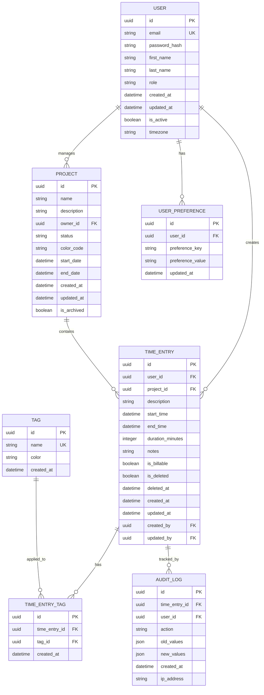

# Data Model - UC-01: Manage Time

## Overview

This document describes the data entities, their attributes, relationships, and constraints for the Manage Time use case.

---

## Entity-Relationship Diagram (ERD)



---

## Entities

### 1. USER

**Description**: Represents a user in the system who can create and manage time entries.

**Attributes**:

| Attribute | Type | Constraints | Description |
|-----------|------|-------------|-------------|
| id | UUID | PRIMARY KEY, NOT NULL | Unique identifier for the user |
| email | VARCHAR(255) | UNIQUE, NOT NULL | User's email address |
| password_hash | VARCHAR(255) | NOT NULL | Hashed password for authentication |
| first_name | VARCHAR(100) | NOT NULL | User's first name |
| last_name | VARCHAR(100) | NOT NULL | User's last name |
| role | ENUM | NOT NULL, DEFAULT 'user' | User role: admin, manager, user |
| created_at | TIMESTAMP | NOT NULL, DEFAULT NOW() | Account creation timestamp |
| updated_at | TIMESTAMP | NOT NULL, DEFAULT NOW() | Last update timestamp |
| is_active | BOOLEAN | NOT NULL, DEFAULT true | Account active status |
| timezone | VARCHAR(50) | NOT NULL, DEFAULT 'UTC' | User's timezone |

**Indexes**:
- PRIMARY KEY: id
- UNIQUE INDEX: email
- INDEX: is_active, role

**Business Rules**:
- Email must be valid format
- Password must meet complexity requirements
- Timezone must be valid IANA timezone

---

### 2. PROJECT

**Description**: Represents a project or category for organizing time entries.

**Attributes**:

| Attribute | Type | Constraints | Description |
|-----------|------|-------------|-------------|
| id | UUID | PRIMARY KEY, NOT NULL | Unique identifier for the project |
| name | VARCHAR(200) | NOT NULL | Project name |
| description | TEXT | NULL | Detailed project description |
| owner_id | UUID | FOREIGN KEY, NOT NULL | Reference to USER.id |
| status | ENUM | NOT NULL, DEFAULT 'active' | Status: active, completed, on_hold |
| color_code | VARCHAR(7) | NULL | Hex color code for UI display |
| start_date | DATE | NULL | Project start date |
| end_date | DATE | NULL | Project end date |
| created_at | TIMESTAMP | NOT NULL, DEFAULT NOW() | Creation timestamp |
| updated_at | TIMESTAMP | NOT NULL, DEFAULT NOW() | Last update timestamp |
| is_archived | BOOLEAN | NOT NULL, DEFAULT false | Archive status |

**Indexes**:
- PRIMARY KEY: id
- FOREIGN KEY: owner_id → USER.id
- INDEX: owner_id, status, is_archived
- INDEX: name (for search)

**Business Rules**:
- Project name must be unique per user
- End date must be after start date
- Archived projects cannot receive new time entries
- Color code must be valid hex format (#RRGGBB)

---

### 3. TIME_ENTRY

**Description**: Represents a single time entry logged by a user.

**Attributes**:

| Attribute | Type | Constraints | Description |
|-----------|------|-------------|-------------|
| id | UUID | PRIMARY KEY, NOT NULL | Unique identifier for the time entry |
| user_id | UUID | FOREIGN KEY, NOT NULL | Reference to USER.id |
| project_id | UUID | FOREIGN KEY, NULL | Reference to PROJECT.id |
| description | VARCHAR(500) | NOT NULL | Activity description |
| start_time | TIMESTAMP | NOT NULL | Entry start time |
| end_time | TIMESTAMP | NULL | Entry end time (NULL for running timer) |
| duration_minutes | INTEGER | NULL | Calculated duration in minutes |
| notes | TEXT | NULL | Additional notes |
| is_billable | BOOLEAN | NOT NULL, DEFAULT false | Whether entry is billable |
| is_deleted | BOOLEAN | NOT NULL, DEFAULT false | Soft delete flag |
| deleted_at | TIMESTAMP | NULL | Deletion timestamp |
| created_at | TIMESTAMP | NOT NULL, DEFAULT NOW() | Creation timestamp |
| updated_at | TIMESTAMP | NOT NULL, DEFAULT NOW() | Last update timestamp |
| created_by | UUID | FOREIGN KEY, NOT NULL | User who created the entry |
| updated_by | UUID | FOREIGN KEY, NULL | User who last updated the entry |

**Indexes**:
- PRIMARY KEY: id
- FOREIGN KEY: user_id → USER.id
- FOREIGN KEY: project_id → PROJECT.id
- FOREIGN KEY: created_by → USER.id
- FOREIGN KEY: updated_by → USER.id
- INDEX: user_id, start_time (for user's time log)
- INDEX: project_id, start_time (for project reports)
- INDEX: is_deleted, deleted_at (for cleanup)
- INDEX: start_time, end_time (for overlap detection)

**Business Rules**:
- end_time must be after start_time
- duration_minutes automatically calculated: (end_time - start_time) in minutes
- Maximum duration: 1440 minutes (24 hours)
- start_time cannot be in the future
- Soft delete: is_deleted = true, entry retained for 30 days
- After 30 days, permanently deleted entries are removed via cleanup job

---

### 4. TAG

**Description**: Represents tags/labels that can be applied to time entries for categorization.

**Attributes**:

| Attribute | Type | Constraints | Description |
|-----------|------|-------------|-------------|
| id | UUID | PRIMARY KEY, NOT NULL | Unique identifier for the tag |
| name | VARCHAR(50) | UNIQUE, NOT NULL | Tag name |
| color | VARCHAR(7) | NULL | Hex color code for display |
| created_at | TIMESTAMP | NOT NULL, DEFAULT NOW() | Creation timestamp |

**Indexes**:
- PRIMARY KEY: id
- UNIQUE INDEX: name
- INDEX: name (for search/autocomplete)

**Business Rules**:
- Tag name must be unique (case-insensitive)
- Tag name cannot be empty or whitespace only
- Maximum 50 characters

---

### 5. TIME_ENTRY_TAG

**Description**: Junction table for many-to-many relationship between TIME_ENTRY and TAG.

**Attributes**:

| Attribute | Type | Constraints | Description |
|-----------|------|-------------|-------------|
| id | UUID | PRIMARY KEY, NOT NULL | Unique identifier |
| time_entry_id | UUID | FOREIGN KEY, NOT NULL | Reference to TIME_ENTRY.id |
| tag_id | UUID | FOREIGN KEY, NOT NULL | Reference to TAG.id |
| created_at | TIMESTAMP | NOT NULL, DEFAULT NOW() | Creation timestamp |

**Indexes**:
- PRIMARY KEY: id
- FOREIGN KEY: time_entry_id → TIME_ENTRY.id (CASCADE DELETE)
- FOREIGN KEY: tag_id → TAG.id (CASCADE DELETE)
- UNIQUE INDEX: (time_entry_id, tag_id)
- INDEX: time_entry_id
- INDEX: tag_id

**Business Rules**:
- A time entry can have multiple tags
- A tag can be applied to multiple time entries
- Duplicate tag assignments are prevented by unique constraint
- When time entry is deleted, associated tags are removed

---

### 6. USER_PREFERENCE

**Description**: Stores user-specific preferences and settings.

**Attributes**:

| Attribute | Type | Constraints | Description |
|-----------|------|-------------|-------------|
| id | UUID | PRIMARY KEY, NOT NULL | Unique identifier |
| user_id | UUID | FOREIGN KEY, NOT NULL | Reference to USER.id |
| preference_key | VARCHAR(100) | NOT NULL | Preference key/name |
| preference_value | TEXT | NULL | Preference value (JSON string) |
| updated_at | TIMESTAMP | NOT NULL, DEFAULT NOW() | Last update timestamp |

**Indexes**:
- PRIMARY KEY: id
- FOREIGN KEY: user_id → USER.id (CASCADE DELETE)
- UNIQUE INDEX: (user_id, preference_key)
- INDEX: user_id

**Common Preferences**:
- `default_project`: Default project ID for new entries
- `timer_auto_start`: Boolean for automatic timer start
- `reminder_enabled`: Boolean for time entry reminders
- `reminder_time`: Time for daily reminder
- `week_start_day`: Integer (0-6) for first day of week

---

### 7. AUDIT_LOG

**Description**: Tracks all changes made to time entries for auditing purposes.

**Attributes**:

| Attribute | Type | Constraints | Description |
|-----------|------|-------------|-------------|
| id | UUID | PRIMARY KEY, NOT NULL | Unique identifier |
| time_entry_id | UUID | FOREIGN KEY, NULL | Reference to TIME_ENTRY.id |
| user_id | UUID | FOREIGN KEY, NOT NULL | User who performed the action |
| action | VARCHAR(50) | NOT NULL | Action type: CREATE, UPDATE, DELETE, RESTORE |
| old_values | JSON | NULL | Previous values (for UPDATE) |
| new_values | JSON | NULL | New values |
| created_at | TIMESTAMP | NOT NULL, DEFAULT NOW() | Action timestamp |
| ip_address | VARCHAR(45) | NULL | User's IP address |

**Indexes**:
- PRIMARY KEY: id
- FOREIGN KEY: time_entry_id → TIME_ENTRY.id
- FOREIGN KEY: user_id → USER.id
- INDEX: time_entry_id, created_at
- INDEX: user_id, created_at
- INDEX: action, created_at

**Business Rules**:
- Audit logs are immutable (never updated or deleted)
- Retained for 1 year minimum
- old_values and new_values stored as JSON for flexibility

---

## Relationships

### One-to-Many Relationships

1. **USER → TIME_ENTRY**
   - One user can create many time entries
   - Each time entry belongs to exactly one user
   - CASCADE: When user is deleted, decision needed (soft delete or reassign)

2. **USER → PROJECT**
   - One user can own many projects
   - Each project has exactly one owner
   - CASCADE: When user is deleted, projects may be reassigned or archived

3. **PROJECT → TIME_ENTRY**
   - One project can have many time entries
   - Each time entry can belong to zero or one project
   - SET NULL: When project is deleted, time_entry.project_id set to NULL

4. **USER → AUDIT_LOG**
   - One user can have many audit log entries
   - Each audit log entry is associated with one user

### Many-to-Many Relationships

1. **TIME_ENTRY ↔ TAG** (via TIME_ENTRY_TAG)
   - One time entry can have many tags
   - One tag can be applied to many time entries

---

## Data Integrity Constraints

### Referential Integrity
- All foreign keys must reference existing records
- Cascade rules defined for each relationship
- Orphaned records prevented through constraints

### Domain Constraints
- Email format validation
- Date/time consistency checks
- Enum value restrictions
- String length limitations

### Business Logic Constraints
```sql
-- Constraint: end_time must be after start_time
ALTER TABLE TIME_ENTRY
ADD CONSTRAINT chk_time_entry_end_after_start
CHECK (end_time IS NULL OR end_time > start_time);

-- Constraint: duration must be positive
ALTER TABLE TIME_ENTRY
ADD CONSTRAINT chk_time_entry_positive_duration
CHECK (duration_minutes IS NULL OR duration_minutes > 0);

-- Constraint: project end_date must be after start_date
ALTER TABLE PROJECT
ADD CONSTRAINT chk_project_end_after_start
CHECK (end_date IS NULL OR start_date IS NULL OR end_date >= start_date);

-- Constraint: deleted_at must be set when is_deleted is true
ALTER TABLE TIME_ENTRY
ADD CONSTRAINT chk_time_entry_deleted_at
CHECK ((is_deleted = false AND deleted_at IS NULL) OR 
       (is_deleted = true AND deleted_at IS NOT NULL));
```

---

## Database Triggers

### 1. Auto-calculate Duration
```sql
CREATE TRIGGER trg_calculate_duration
BEFORE INSERT OR UPDATE ON TIME_ENTRY
FOR EACH ROW
WHEN (NEW.end_time IS NOT NULL)
EXECUTE FUNCTION calculate_duration();

-- Function to calculate duration in minutes
CREATE FUNCTION calculate_duration()
RETURNS TRIGGER AS $$
BEGIN
    NEW.duration_minutes := EXTRACT(EPOCH FROM (NEW.end_time - NEW.start_time)) / 60;
    RETURN NEW;
END;
$$ LANGUAGE plpgsql;
```

### 2. Update Timestamp
```sql
CREATE TRIGGER trg_update_timestamp
BEFORE UPDATE ON TIME_ENTRY
FOR EACH ROW
EXECUTE FUNCTION update_timestamp();

CREATE FUNCTION update_timestamp()
RETURNS TRIGGER AS $$
BEGIN
    NEW.updated_at := NOW();
    RETURN NEW;
END;
$$ LANGUAGE plpgsql;
```

### 3. Create Audit Log
```sql
CREATE TRIGGER trg_audit_log
AFTER INSERT OR UPDATE OR DELETE ON TIME_ENTRY
FOR EACH ROW
EXECUTE FUNCTION create_audit_log();

CREATE FUNCTION create_audit_log()
RETURNS TRIGGER AS $$
BEGIN
    IF TG_OP = 'DELETE' THEN
        INSERT INTO AUDIT_LOG (time_entry_id, user_id, action, old_values)
        VALUES (OLD.id, OLD.user_id, 'DELETE', row_to_json(OLD));
    ELSIF TG_OP = 'UPDATE' THEN
        INSERT INTO AUDIT_LOG (time_entry_id, user_id, action, old_values, new_values)
        VALUES (NEW.id, NEW.updated_by, 'UPDATE', row_to_json(OLD), row_to_json(NEW));
    ELSIF TG_OP = 'INSERT' THEN
        INSERT INTO AUDIT_LOG (time_entry_id, user_id, action, new_values)
        VALUES (NEW.id, NEW.created_by, 'CREATE', row_to_json(NEW));
    END IF;
    RETURN NULL;
END;
$$ LANGUAGE plpgsql;
```

---

## Sample Data

### Sample Users
```json
{
  "id": "550e8400-e29b-41d4-a716-446655440000",
  "email": "john.doe@example.com",
  "first_name": "John",
  "last_name": "Doe",
  "role": "user",
  "timezone": "America/New_York",
  "is_active": true
}
```

### Sample Project
```json
{
  "id": "660e8400-e29b-41d4-a716-446655440000",
  "name": "Website Redesign",
  "description": "Complete redesign of company website",
  "owner_id": "550e8400-e29b-41d4-a716-446655440000",
  "status": "active",
  "color_code": "#3498db",
  "is_archived": false
}
```

### Sample Time Entry
```json
{
  "id": "770e8400-e29b-41d4-a716-446655440000",
  "user_id": "550e8400-e29b-41d4-a716-446655440000",
  "project_id": "660e8400-e29b-41d4-a716-446655440000",
  "description": "Designed homepage mockup",
  "start_time": "2025-11-03T09:00:00Z",
  "end_time": "2025-11-03T11:30:00Z",
  "duration_minutes": 150,
  "notes": "Used Figma for design, client approved",
  "is_billable": true,
  "is_deleted": false
}
```

---

## Data Access Patterns

### Common Queries

1. **Get User's Time Entries for Date Range**
```sql
SELECT te.*, p.name as project_name
FROM TIME_ENTRY te
LEFT JOIN PROJECT p ON te.project_id = p.id
WHERE te.user_id = ?
  AND te.start_time >= ?
  AND te.start_time < ?
  AND te.is_deleted = false
ORDER BY te.start_time DESC;
```

2. **Get Total Time by Project**
```sql
SELECT p.name, SUM(te.duration_minutes) as total_minutes
FROM TIME_ENTRY te
JOIN PROJECT p ON te.project_id = p.id
WHERE te.user_id = ?
  AND te.start_time >= ?
  AND te.start_time < ?
  AND te.is_deleted = false
GROUP BY p.id, p.name
ORDER BY total_minutes DESC;
```

3. **Detect Overlapping Time Entries**
```sql
SELECT *
FROM TIME_ENTRY
WHERE user_id = ?
  AND is_deleted = false
  AND (
    (start_time <= ? AND end_time > ?) OR
    (start_time < ? AND end_time >= ?) OR
    (start_time >= ? AND end_time <= ?)
  );
```

---

## Data Retention Policy

- **Active Data**: Retained indefinitely while user account is active
- **Soft Deleted Entries**: Retained for 30 days, then permanently deleted
- **Audit Logs**: Retained for 1 year minimum, then archived
- **Archived Projects**: Retained indefinitely but not included in active queries
- **User Account Deletion**: Data anonymized or deleted per GDPR requirements

---

## Performance Considerations

### Indexing Strategy
- Composite indexes on frequently queried columns
- Covering indexes for common report queries
- Partial indexes for is_deleted = false

### Partitioning
- Consider partitioning TIME_ENTRY by date ranges (monthly/yearly)
- Implement when table exceeds 10 million rows

### Caching
- Cache user preferences
- Cache project lists per user
- Cache frequently accessed time entries (last 7 days)

---

[← Back to Use Case](./README.md) | [View Flowchart →](./flowchart.md)
