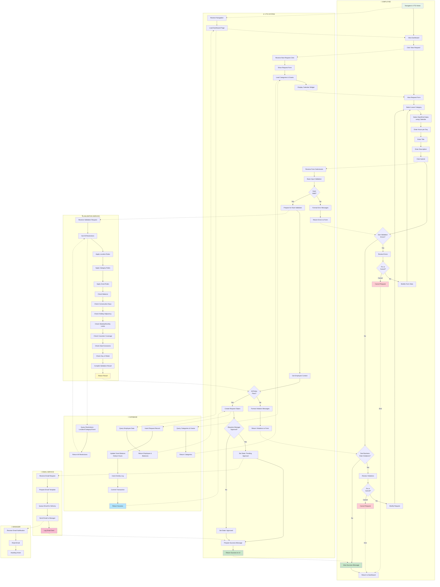

```mermaid
graph TB
    subgraph Employee["👤 EMPLOYEE"]
        E1[Navigate to VTS Home]
        E2[View Dashboard]
        E3[Click 'New Request']
        E4[View Request Form]
        E5[Select Leave Category]
        E6[Select Start/End Dates<br/>using Calendar]
        E7[Enter Hours per Day]
        E8[Enter Title]
        E9[Enter Description]
        E10[Click Submit]
        E11{See Validation<br/>Errors?}
        E12[Review Errors]
        E13{Fix or<br/>Cancel?}
        E14[Modify Form Data]
        E15[Cancel Request]
        E16{See Business<br/>Rule Violations?}
        E17[Review Violations]
        E18{Fix or<br/>Cancel?}
        E19[Modify Request]
        E20[Cancel Request]
        E21[View Success Message]
        E22[Return to Dashboard]
    end
    
    subgraph VTS_System["⚙️ VTS SYSTEM"]
        S1[Receive Navigation]
        S2[Load Dashboard Page]
        S3[Receive New Request Click]
        S4[Show Request Form]
        S5[Load Categories & Grants]
        S6[Display Calendar Widget]
        S7[Receive Form Submission]
        S8[Basic Input Validation]
        S9{Input<br/>Valid?}
        S10[Format Error Messages]
        S11[Return Errors to Form]
        S12[Prepare for Rule Validation]
        S13[Get Employee Context]
        S14{All Rules<br/>Pass?}
        S15[Format Violation Messages]
        S16[Return Violations to Form]
        S17[Create Request Object]
        S18{Requires Manager<br/>Approval?}
        S19[Set State: Pending Approval]
        S20[Set State: Approved]
        S21[Prepare Success Message]
        S22[Return Success to UI]
    end
    
    subgraph Validation_Service["🔍 VALIDATION SERVICE"]
        V1[Receive Validation Request]
        V2[Get All Restrictions]
        V3[Apply Location Rules]
        V4[Apply Category Rules]
        V5[Apply Grant Rules]
        V6[Check Balance]
        V7[Check Consecutive Days]
        V8[Check Holiday Adjacency]
        V9[Check Weekly/Monthly Limits]
        V10[Check Coworker Coverage]
        V11[Check Date Exclusions]
        V12[Check Day of Week]
        V13[Compile Validation Result]
        V14[Return Result]
    end
    
    subgraph Database["💾 DATABASE"]
        D1[Query Employee Data]
        D2[Return Employee & Balances]
        D3[Query Categories & Grants]
        D4[Return Categories]
        D5[Query Restrictions<br/>Location/Category/Grant]
        D6[Return All Restrictions]
        D7[Insert Request Record]
        D8[Update Grant Balance<br/>Deduct Hours]
        D9[Insert Activity Log]
        D10[Commit Transaction]
        D11[Return Success]
    end
    
    subgraph Email_Service["📧 EMAIL SERVICE"]
        M1[Receive Email Request]
        M2[Prepare Email Template]
        M3[Queue Email for Delivery]
        M4[Send Email to Manager]
        M5[Log Email Sent]
    end
    
    subgraph Manager["👔 MANAGER"]
        MG1[Receive Email Notification]
        MG2[Read Email]
        MG3[Awaiting Action]
    end
    
    %% Employee Flow
    E1 --> E2
    E2 --> E3
    E3 --> E4
    E4 --> E5
    E5 --> E6
    E6 --> E7
    E7 --> E8
    E8 --> E9
    E9 --> E10
    E10 --> E11
    E11 -->|Yes| E12
    E12 --> E13
    E13 -->|Fix| E14
    E13 -->|Cancel| E15
    E14 --> E5
    E15 -.->|End| E22
    E11 -->|No| E16
    E16 -->|Yes| E17
    E17 --> E18
    E18 -->|Fix| E19
    E18 -->|Cancel| E20
    E19 --> E5
    E20 -.->|End| E22
    E16 -->|No| E21
    E21 --> E22
    
    %% System Flow
    E1 -.-> S1
    S1 --> S2
    S2 -.-> E2
    E3 -.-> S3
    S3 --> S4
    S4 --> S5
    S5 --> S6
    S6 -.-> E4
    E10 -.-> S7
    S7 --> S8
    S8 --> S9
    S9 -->|No| S10
    S10 --> S11
    S11 -.-> E11
    S9 -->|Yes| S12
    S12 --> S13
    S13 --> S14
    S14 -->|No| S15
    S15 --> S16
    S16 -.-> E16
    S14 -->|Yes| S17
    S17 --> S18
    S18 -->|Yes| S19
    S18 -->|No| S20
    S19 --> S21
    S20 --> S21
    S21 --> S22
    S22 -.-> E21
    
    %% Validation Service Flow
    S12 -.-> V1
    V1 --> V2
    V2 --> V3
    V3 --> V4
    V4 --> V5
    V5 --> V6
    V6 --> V7
    V7 --> V8
    V8 --> V9
    V9 --> V10
    V10 --> V11
    V11 --> V12
    V12 --> V13
    V13 --> V14
    V14 -.-> S14
    
    %% Database Flow
    S2 -.-> D1
    D1 --> D2
    D2 -.-> S2
    S5 -.-> D3
    D3 --> D4
    D4 -.-> S5
    V2 -.-> D5
    D5 --> D6
    D6 -.-> V2
    S17 -.-> D7
    D7 --> D8
    D8 --> D9
    D9 --> D10
    D10 --> D11
    D11 -.-> S17
    
    %% Email Service Flow
    S19 -.-> M1
    M1 --> M2
    M2 --> M3
    M3 --> M4
    M4 --> M5
    M5 -.-> S21
    
    %% Manager Flow
    M4 -.-> MG1
    MG1 --> MG2
    MG2 --> MG3
    
    style E1 fill:#E8F5E9
    style E15 fill:#FFCDD2
    style E20 fill:#FFCDD2
    style E21 fill:#C8E6C9
    style S22 fill:#C8E6C9
    style V14 fill:#FFF9C4
    style D11 fill:#B3E5FC
    style M5 fill:#F8BBD0
```
