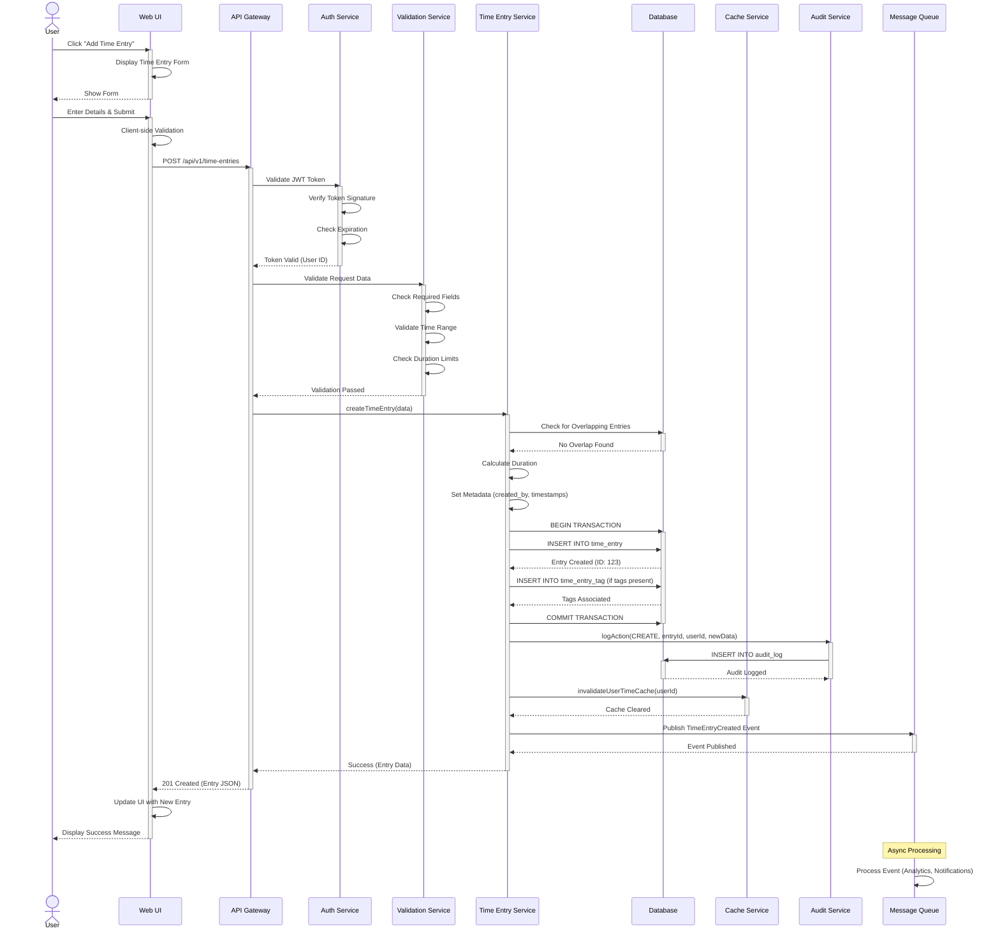
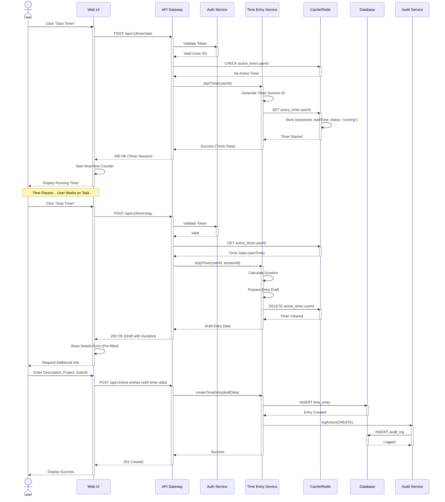
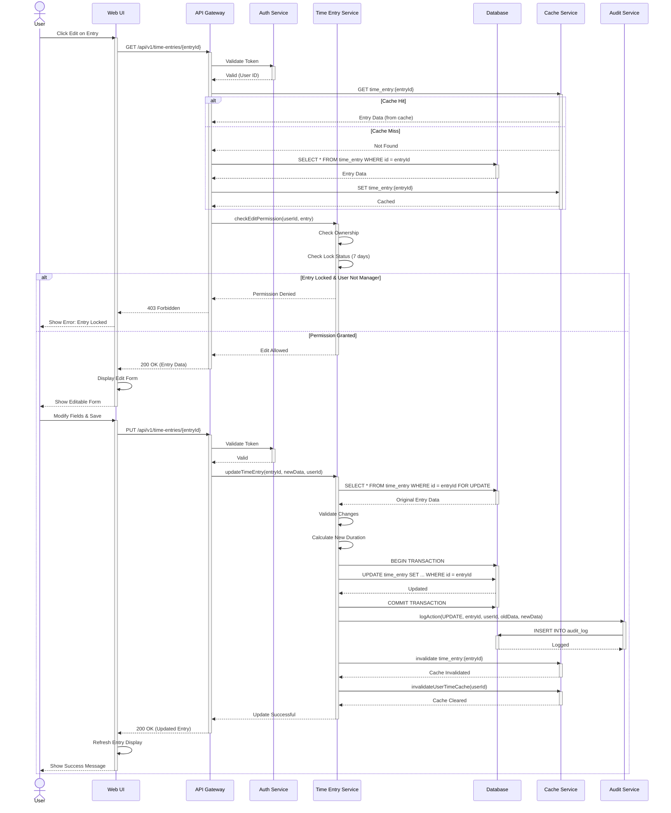
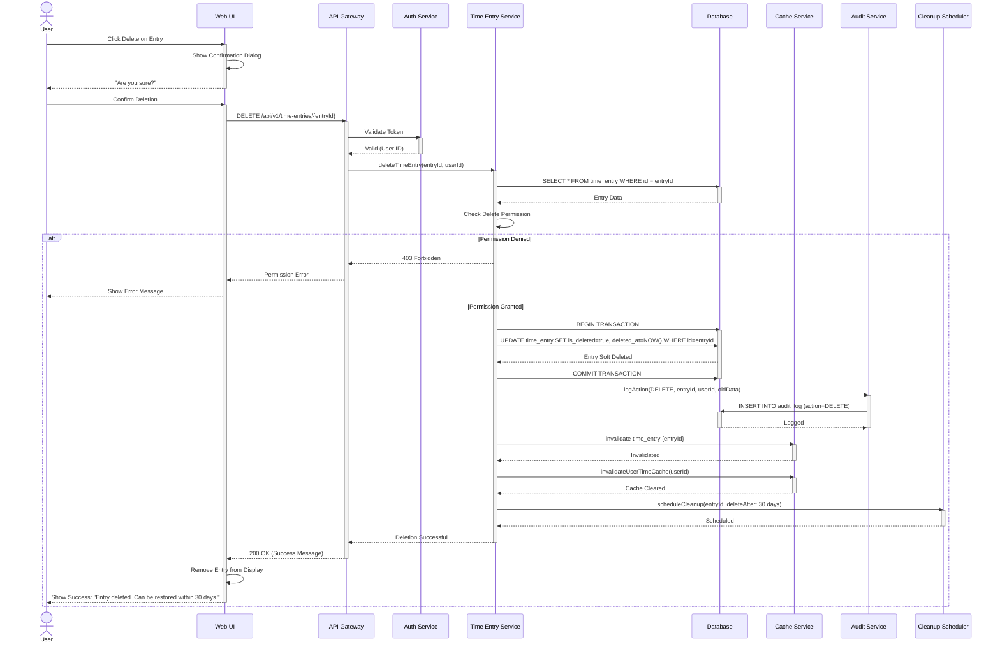
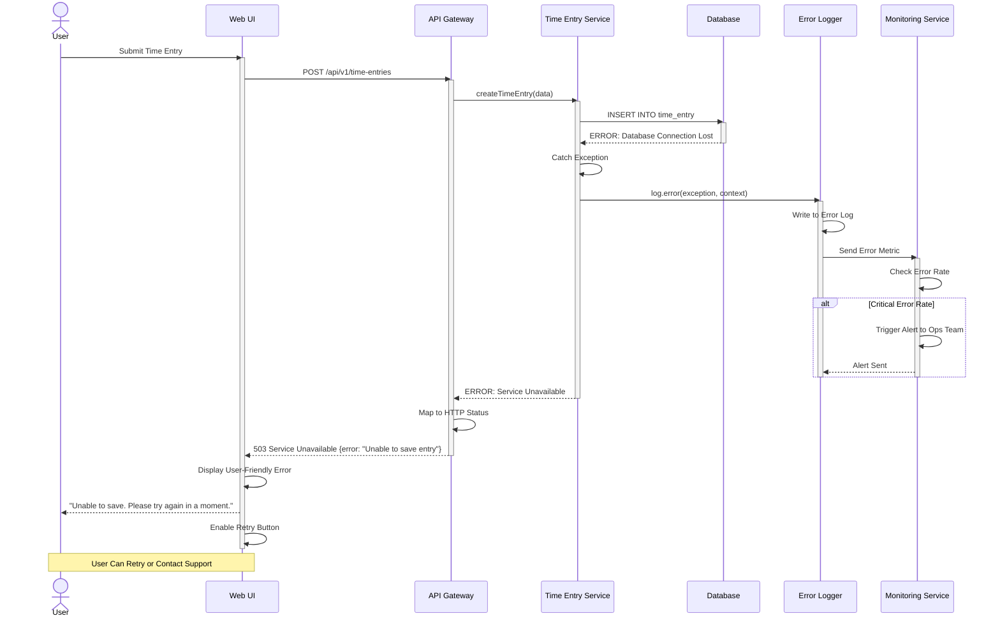
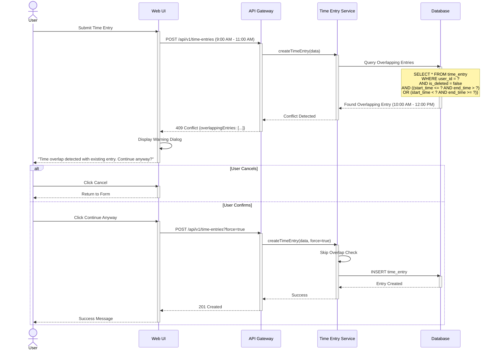

# Sequence Diagram - UC-01: Manage Time

## Overview

This document illustrates the interactions between different system components and actors during time entry management operations. The sequence diagrams show the message flow and timing of operations.

---

## Main Flow: Create Time Entry

---

## Alternative Flow: Timer Mode

---

## Alternative Flow: Edit Time Entry

---

## Alternative Flow: Delete Time Entry (Soft Delete)

---

## Error Handling Sequence

---

## Overlap Detection Sequence

---

## Sequence Diagram Notation Reference

### Participants
- **Actor (User)**: Human user interacting with the system
- **UI**: Frontend/Client application
- **API Gateway**: API entry point and router
- **Auth Service**: Authentication and authorization
- **Time Entry Service**: Business logic for time management
- **Database**: Data persistence layer
- **Cache**: Redis or similar caching layer
- **Audit Service**: Audit logging service
- **Queue**: Message queue for async processing

### Message Types
- **Solid Arrow (→)**: Synchronous call
- **Dashed Arrow (-->)**: Response/Return
- **Activation Bar**: When component is actively processing

### Timing Characteristics

| Operation | Expected Duration |
|-----------|------------------|
| API Request → Response | 100-500ms |
| Database Query | 10-100ms |
| Cache Operation | 1-10ms |
| Validation | < 50ms |
| Authentication | 20-100ms |
| Audit Logging (async) | N/A (non-blocking) |

---

## Component Interaction Matrix

| Source | Target | Interaction Type | Frequency | Notes |
|--------|--------|-----------------|-----------|-------|
| UI | API Gateway | HTTP REST | High | All user actions |
| API Gateway | Auth Service | gRPC/HTTP | Every request | Token validation |
| API Gateway | Time Service | Internal Call | High | Business logic |
| Time Service | Database | SQL | High | Data persistence |
| Time Service | Cache | Redis Protocol | Very High | Read-through cache |
| Time Service | Audit Service | Async Message | Medium | All mutations |
| Time Service | Queue | AMQP/Kafka | Low | Event publishing |

---

## Security Considerations

1. **Authentication Flow**
   - JWT token validated on every request
   - Token includes user ID and permissions
   - Expired tokens rejected at API Gateway

2. **Authorization Checks**
   - Ownership verification before modifications
   - Role-based permission checks
   - Manager override for locked entries

3. **Data Protection**
   - All communications over HTTPS/TLS
   - Database credentials secured in vault
   - Sensitive data encrypted at rest

---

## Performance Optimization

1. **Caching Strategy**
   - Time entries cached for 5 minutes
   - User cache invalidated on mutations
   - Cache-aside pattern with read-through

2. **Database Optimization**
   - Indexed queries for performance
   - Transaction batching where possible
   - Connection pooling

3. **Async Processing**
   - Audit logging non-blocking
   - Event publishing asynchronous
   - Background jobs for cleanup

---

[← Back to Use Case](./README.md) | [View Pseudocode →](./pseudocode.md)
